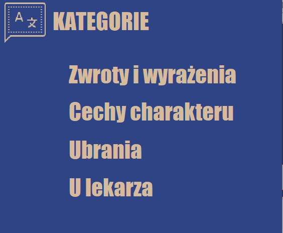
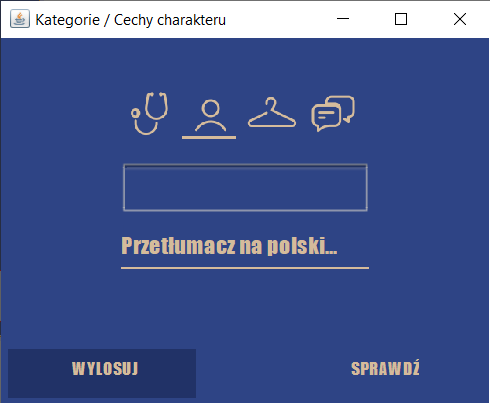
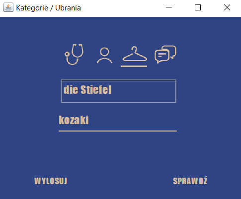

# Flashcards
> A simple flashcard application made for University assignement purposes. 

## Table of contents
* [General info](#general-info)
* [Screenshots](#screenshots)
* [Technologies](#technologies)
* [Setup](#setup)
* [Features](#features)
* [Status](#status)
* [Inspiration](#inspiration)
* [Contact](#contact)

## General info
Flashcards applciation helps you learn new German words. You choose the category, then it generates a random word in German and shows the translation in Polsih. 

## Screenshots
  


## Technologies
* Netbeans IDE 
* SQL Server Management Studio 

## Setup
To install this application you'll need to add a connection to your local database. 

## Code Examples
Connection to the database:
```java
public class BazaDanych {
    public void losLekarz(JTextArea tSlowko, JTextField tTlumacz) {
        try {
            Class.forName("com.microsoft.sqlserver.jdbc.SQLServerDriver");
            Connection polaczenie = DriverManager.getConnection(
                    "jdbc:sqlserver://localhost\\servername;databaseName=Flashcards",
                    "login", "password"
            );
            PreparedStatement ps = 
                    connection.prepareStatement("{call dbo.slownikLekarz}");
            ResultSet rezultat = ps.executeQuery();
            while (rezultat.next()) {
                tSlowko.append(rezultat.getString("niemiecki") + "\n" );
                tTlumacz.setText(rezultat.getString("polski"));
            }
            connection.close();
        }
        catch (Exception e) {
            JOptionPane.showMessageDialog(null, "Błąd " + e.getMessage(), 
                    "Błąd", JOptionPane.ERROR_MESSAGE);
            
        }
    }
```
Generates a random word from a specific category (in this case it's "Personality")
```java
    public void losCharakter(JTextArea tSlowko, JTextField tTlumacz) {
        try {
            Class.forName("com.microsoft.sqlserver.jdbc.SQLServerDriver");
            Connection polaczenie = DriverManager.getConnection(
                    "jdbc:sqlserver://localhost\\MSSQLSERVER01;databaseName=Slownik",
                    "sa", "student"
            );
            PreparedStatement ps = 
                    polaczenie.prepareStatement("{call dbo.slownikCharakter}");
            ResultSet rezultat = ps.executeQuery();
            while (rezultat.next()) {
                tSlowko.append(rezultat.getString("niemiecki"));
                tTlumacz.setText(rezultat.getString("polski"));
            }
            polaczenie.close();
        }
        catch (Exception e) {
            JOptionPane.showMessageDialog(null, "Błąd " + e.getMessage(), 
                    "Błąd", JOptionPane.ERROR_MESSAGE);
            
        }
    }
```
SQL procedure that generates the random word
```sql
procedure losCharakter
as
begin
	select german from PersonalityGerman where id=round(rand()*(select MAX(id) from PersonalityGerman),0)
end
```

## Features
List of features ready and TODOs for future development
* Four different categories to choose from

To-do list:
* Typing the translation by the users themselves
* Program checking the spelling and the correct translation

## Status
Project is: _no longer continue_ due to final exams.

## Inspiration
Add here credits. Project based on the University of Gdańsk classes

## Contact
Created by [@jcieszynska](https://www.github.com/jcieszynska) - feel free to contact me!
